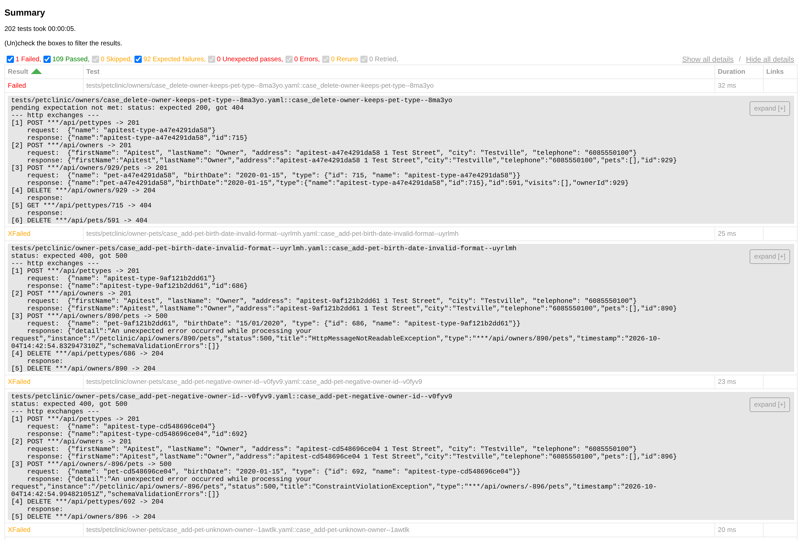

# repo2test

**API 测试要验证的是代码逻辑，不是把实现抄一遍。** Claude Code 或 Codex 能基于你的后端仓库生成一套测试，你描述变更时，它还会补上端到端测试。

[English](README.md) · [真实运行结果](#真实运行结果) · [为什么用 repo2test](#为什么用-repo2test) ·
[开始使用](#开始使用) · [适用范围](#适用范围)

## 真实运行结果

我们让 Claude Code 为
[spring-petclinic-rest](https://github.com/spring-petclinic/spring-petclinic-rest)
创建正常路径和边界情况的 API 测试，然后对本地启动的实例运行。这是一个 Spring Boot
服务，契约里有 37 个操作。

agent 清点出 44 个接口、307 个行为，写了 202 个用例，并记录了 13 处实现与它自己的
OpenAPI 契约不一致的地方。整套用例运行约 5 秒：

| 结果 | 用例数 |
|---|---|
| 通过 | 109 |
| 复现了已记录的契约冲突（`XFAIL`） | 92，对应 11 条缺陷记录 |
| 失败，原因是契约没有规定该行为 | 1 |

没有依据的地方它不猜：82 个行为被列为阻塞，主要是需要测试身份的权限校验；23 个被列为
缺口，每一个都写明了原因。



全部产出是一个可以直接阅读的 Git 仓库：
[spring-petclinic-rest-e2e](https://github.com/lawli/spring-petclinic-rest-e2e)。
生成的用例、缺陷记录和覆盖统计的样例见[英文 README](README.md#a-real-run)。

**同样的请求用在 FastAPI 上。** 对
[full-stack-fastapi-template](https://github.com/fastapi/full-stack-fastapi-template)
（一个使用 PostgreSQL 和 token 登录的 FastAPI 项目），agent 清点出 28 个接口、148 个
行为，写了 90 个用例。运行结果是 84 个通过，并复现了 6 处已记录的冲突。被覆盖的 144 个
行为里有 71 个标为待确认而不是已确认，因为它们的预期响应只出现在处理函数的代码里，
repo2test 不把实现当作契约。产出见
[full-stack-fastapi-template-e2e](https://github.com/lawli/full-stack-fastapi-template-e2e)。

## 为什么用 repo2test

- **预期来自契约，不来自当前行为。** 每个被覆盖的行为都记录依据：需求、OpenAPI 条目或
  校验注解所在的文件和行号；这些都没有时，可以用仓库自带的测试作为依据，并单独计数。
  没有依据时，预期标为待确认，不会凭空编造。
- **冲突会变成缺陷记录。** 代码与契约矛盾时，用例继续断言契约，并把冲突写成记录，两边
  都给出文件和行号。
- **缺口保持可见。** 先清点接口和行为，再写用例。没有覆盖的部分会被列为未覆盖、阻塞或
  缺口，并写明原因。
- **非生产环境之外禁止写操作。** 会修改数据的用例只在你声明为非生产的 profile 上运行，
  并且要求数据隔离和可执行的清理。
- **测试集不依赖 agent 存活。** 产出是一个普通的 Git 仓库，里面是 YAML 用例和锁定版本
  的 runner。同事和 CI 用 Python 和 uv 就能运行，不需要 agent，也不需要本框架的源码。

## 开始使用

把这句话贴给 Claude Code 或 Codex：

```text
Install the repo2test skill by following https://github.com/lawli/repo2test#installation. Installation only.
```

然后在你的后端仓库里启动 agent，对它说：

```text
/repo2test 为这个 repo 创建正常路径和边界情况的 API test cases，使用 local profile，不要运行测试。
```

在 Codex 里这个 skill 写作 `$repo2test`。第一次使用时，agent 会在你的代码旁边准备
一个测试仓库：它自己下载已发布的 runner，从你的仓库里推断出各项设置，然后请你确认一次。
详见[英文 README 的首次设置一节](README.md#create-your-first-test-workspace)。

## 适用范围

后端仓库的 HTTP API，包括同一仓库内跨服务的顺序流程。不适用于单元测试、UI 测试和
压力测试。

已在 Spring Boot 和 FastAPI 上验证，就是上面的两次运行。用例格式、runner 和 agent 的
工作方法都不绑定框架；在其他技术栈上 agent 按同样的方式工作，并在报告里注明该技术栈
未经验证。目前有两处范围更窄：

- `apitest reconcile`（对接口清单的机械核对）内置了 Spring 和 FastAPI 的路由写法。在
  其他技术栈上由 agent 把该框架的路由写法作为模式传入，输出里会记录所用的模式和匹配结果。
- 数据库、缓存和消息队列的校验只支持 MySQL、Redis 和 RabbitMQ。只调用 API 的用例不需要
  它们。

在你的技术栈上遇到问题，欢迎[提 issue](https://github.com/lawli/repo2test/issues)。

---

完整的参考手册（安装、首次设置、agent 规则、在 CI 中运行、故障排查）见
[英文 README 的 Reference 部分](README.md#reference)。
